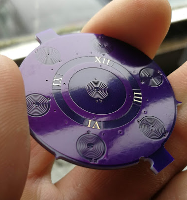
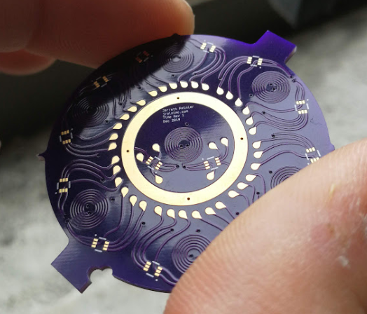
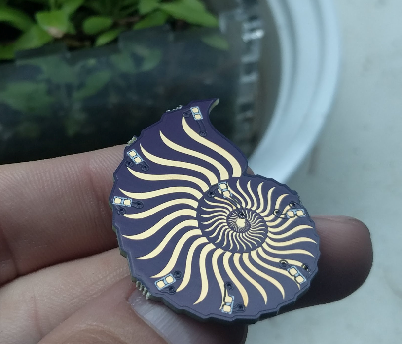
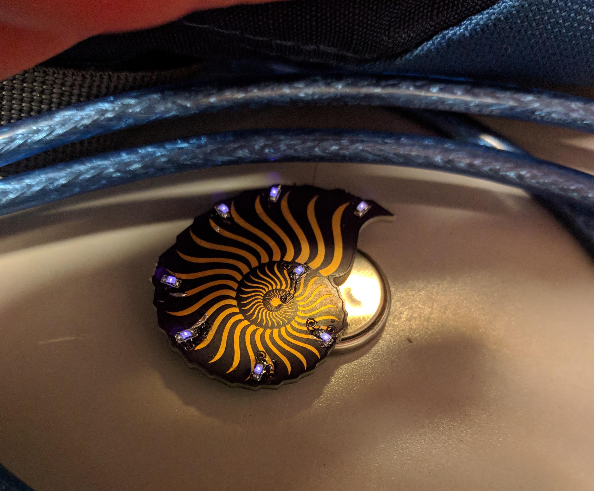
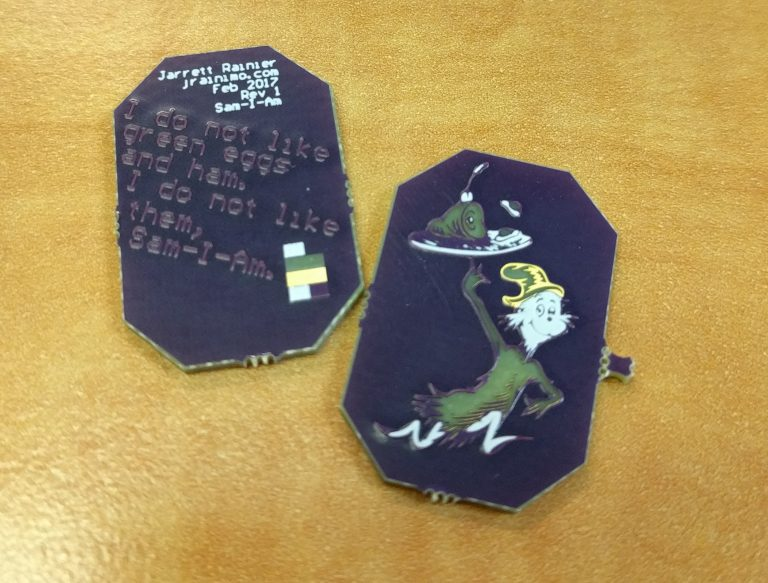
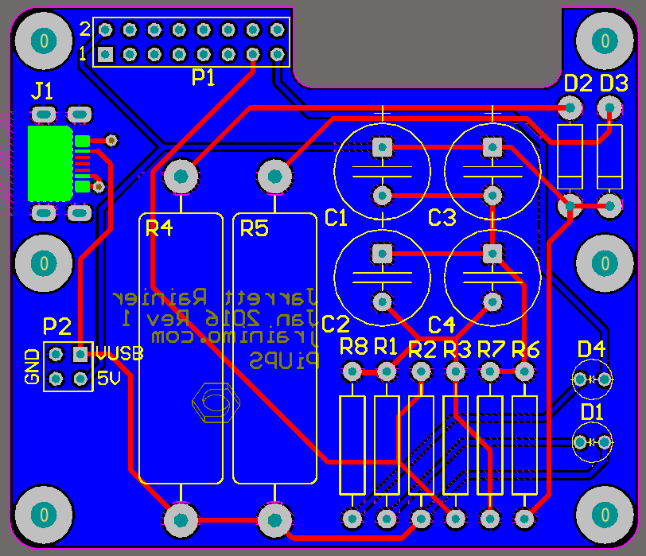
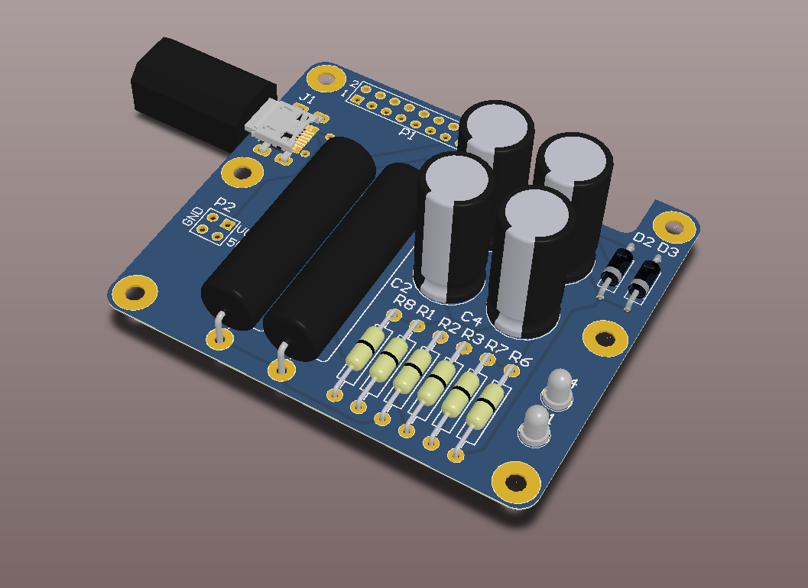

# PCBs
Not the environment-killing thing. Well, a little environment-killing.

# What is this?
Just doodles. In hardware. Any project that is documented here that turns serious will get spun off into its own repo.

Most of the things that make it to a boardhouse will end up being described at http://www.jrainimo.com in some form.

I will attempt to include a short readme with an overview of the project in each folder. Sometimes, the purpose of a design is not obvious without an explanation. Many of them, however, have no explanation.

The folders are numbered chronologically, approximately. This means that higher numbers will be more recent, and therefore more interesting, generally.

# What's good?

### Time

### Shallow

### ColourTest

### Raspberry-Power

